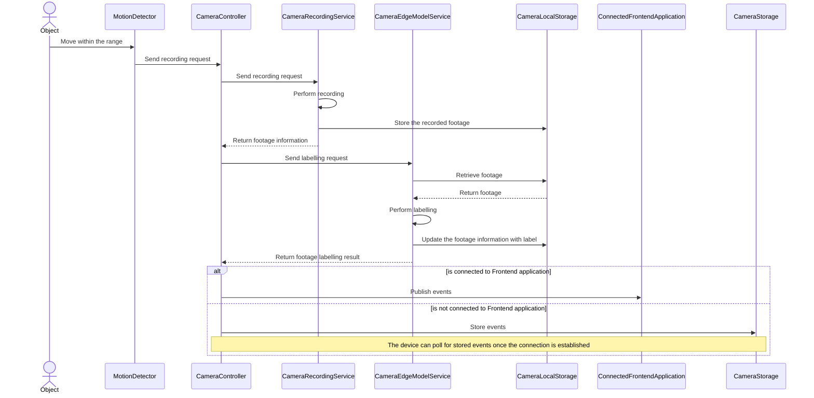
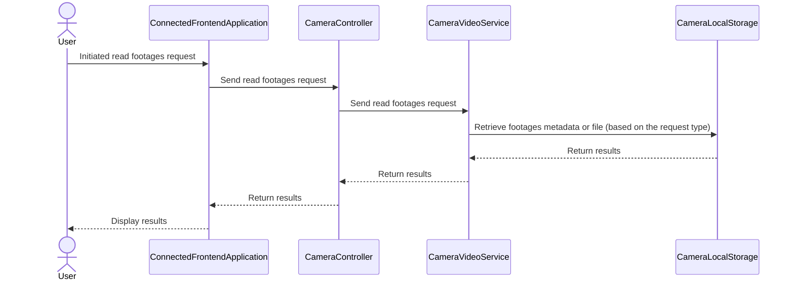
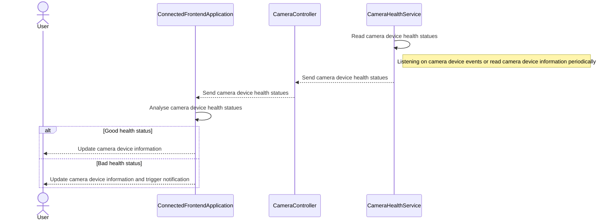
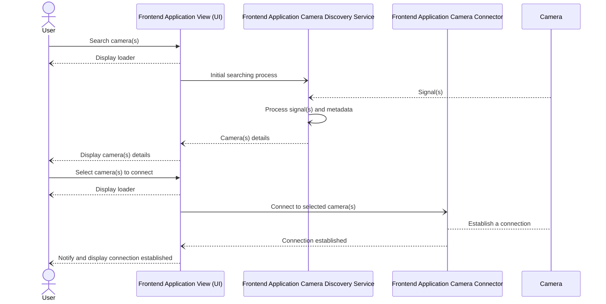
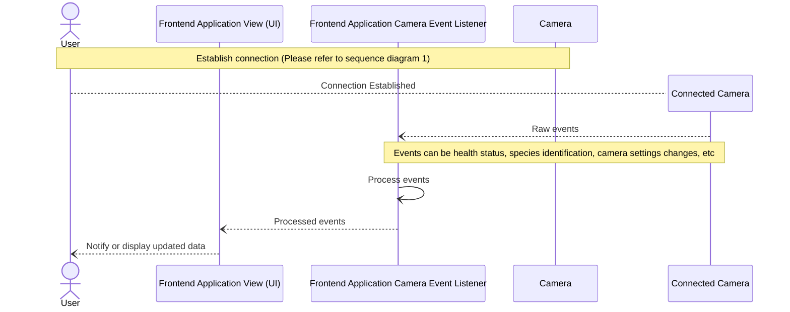
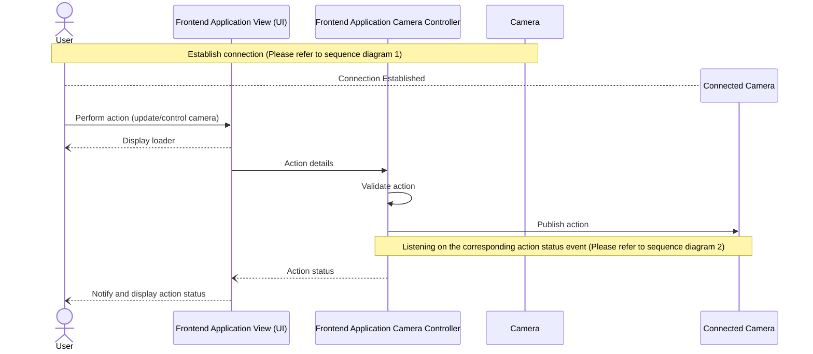
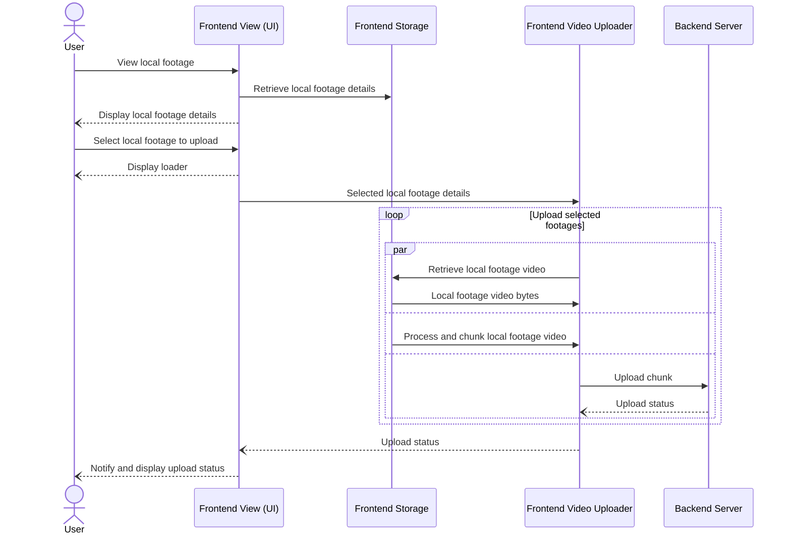

# Camera Features

### Main Components: 
1. **MotionDetector** - A component that is responsible to detect motion and notify other component 
2. **CameraController** - A controller that is responsible provide an interface to interact with other components
3. **CameraRecordingService** - A service that is responsible to perform recoding
4. **CameraEdgeModelService** - A service that is responsible for using AI edge model to perform footage species labelling
5. **CameraLocalStorage** - A data access layer that is responsible for storing or accessing data
6. **CameraVideoService** - A service that is responsible for reading and writing video
7. **CameraHealthService** - A service that is responsible for reading the camera health statuses

### Sequence Digrams (Features):

#### Captures and labels footage

#### Read footages

#### Health status reporting

# Frontend Application (Mobile, Web, Desktop)

### Establish connection

### Listening on connected camera event(s)

### Control connected camera

### Upload local footages to backend server

# Backend Application 
