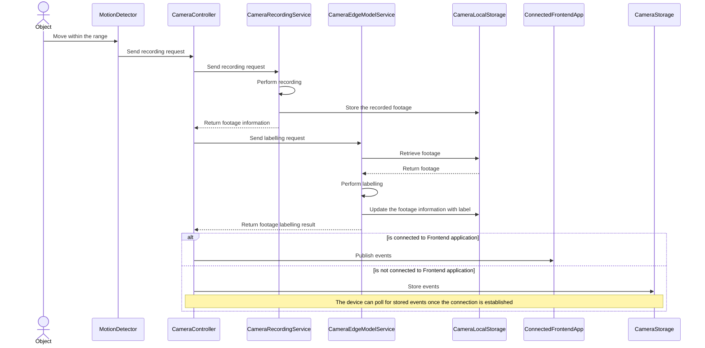
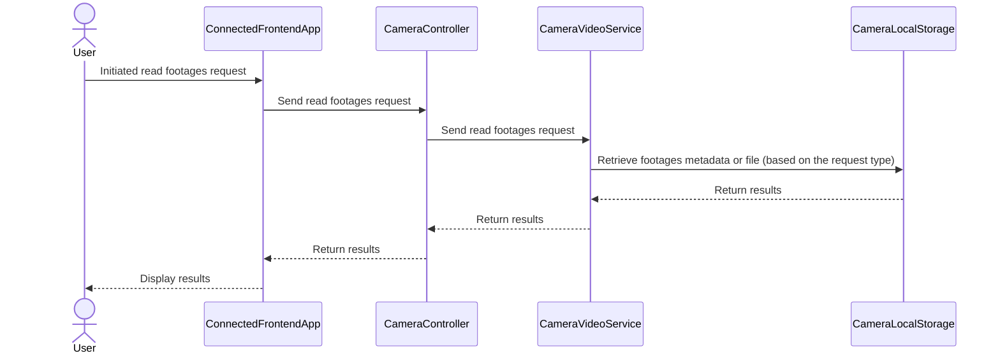
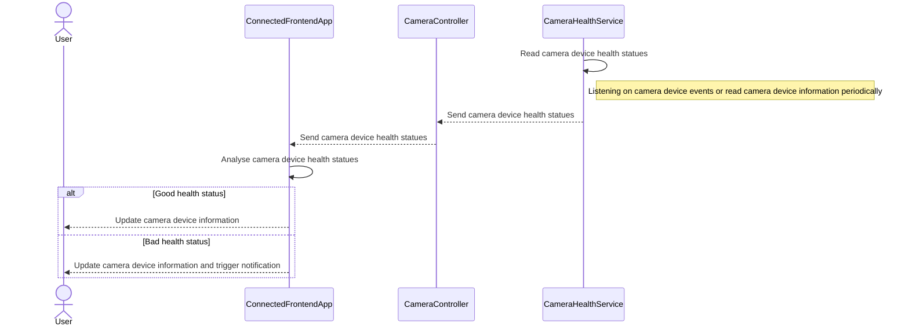
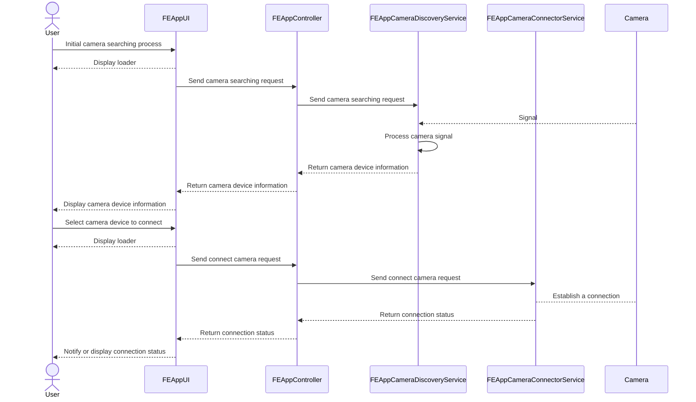
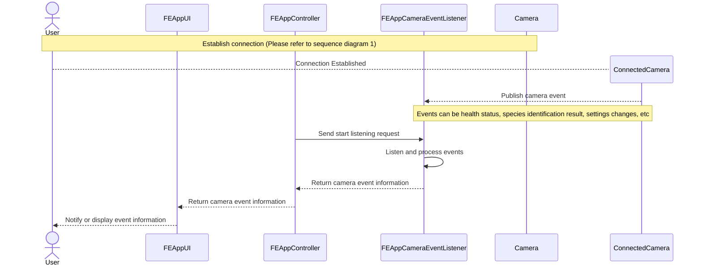
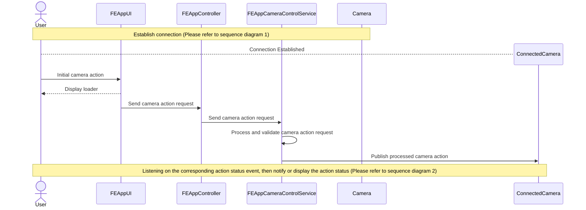
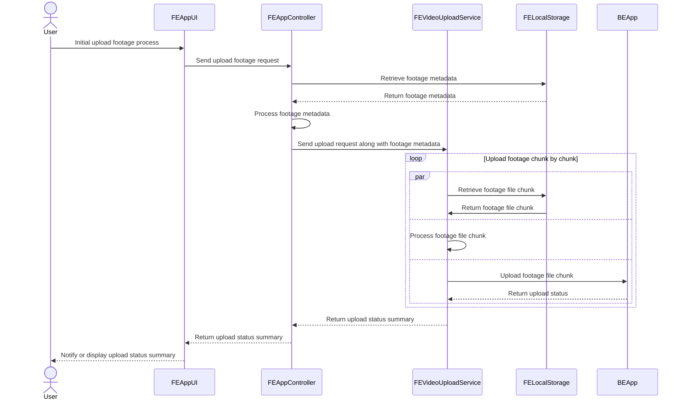
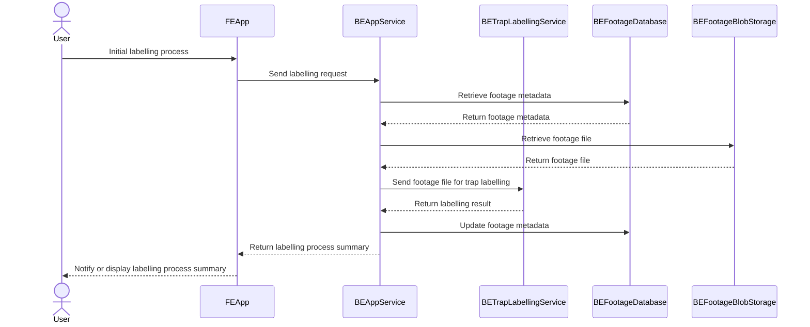
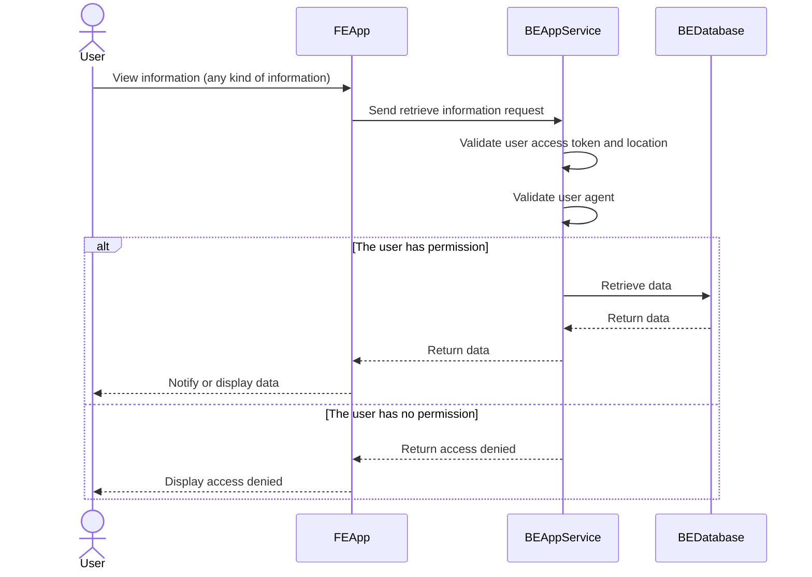

# Requirements

### Functional Requirements

1. The camera footage should be stored within SD card before uploading to the frontend application (mobile or desktop) or application server. 
2. The camera should be able to send notification to the frontend application (mobile or desktop) via LoraWan, 3G, or Satellite. 
3. The camera should be able to report its health status to frontend application (mobile or desktop). 
4. The camera should be able to report species identification to frontend application (mobile or desktop).
5. The camera should be able to store edge models. 
6. The camera should be able to use the edge models to perform species analysis and identification. 
7. The camera should record a 5 to 10 seconds video when a motion is detected. 
8. The user should be able to retrieve video footage from camera via SD card, LoraWan, 3G, or Satellite. 
9. The user should be able to store video footage offline in the mobile or desktop.
10. The user should be able to upload video footage to application server (via frontend application - mobile or desktop).
11. The user should be able to discover nearby camera (via frontend application - mobile or desktop).
12. The user should be able to connect to a specific camera (via frontend application - mobile or desktop).
13. The user should be able to receive notifications from the camera (via frontend application - mobile or desktop).
14. The user should be able to view the camera status details (via frontend application - mobile or desktop).
15. The user should be able to control the camera (via frontend application - mobile or desktop).
16. The user should be able to update the camera settings or edge model (via frontend application - mobile or desktop).
17. The user should be able to perform further analysis (via frontend application - mobile or desktop).
18. The user should be able to send the video footage to iNaturalist for help (via frontend application - mobile or desktop).
19. The user should be able to publish the species occurrences to GBIF using the CamTrap DB data exchange format (via frontend application - mobile or desktop).
20. Geoprivacy: https://www.inaturalist.org/pages/help#geoprivacy

## Camera Focus

### Main Components: 
1. **MotionDetector** - A component that is responsible to detect motion and notify other component 
2. **CameraController** - A controller that is responsible to to coordinate the request and response between different components
3. **CameraRecordingService** - A service that is responsible to perform recoding
4. **CameraEdgeModelService** - A service that is responsible for using AI edge model to perform footage species labelling
5. **CameraLocalStorage** - A data access layer that is responsible for storing or accessing data
6. **CameraVideoService** - A service that is responsible for reading and writing video
7. **CameraHealthService** - A service that is responsible for reading the camera health statuses

### Sequence Digrams:

#### Captures and labels footage (1, 2, 4, 5, 6, 7)

#### Retrieves footage from camera device (8)

#### Reports camera device health status (3)

## Frontend Application (Mobile, Web, Desktop) Focus

### Main Components: 

1. **FEAppUI** - A user interface that is responsible to provide a way for user to use the app
2. **FEAppController** - A controller that is responsible to coordinate the request and response between different components
3. **FEAppCameraDiscoveryService** - A service that is responsible to discover camera device
4. **FEAppCameraConnectorService** - A service that is responsible to establish a connection between the mobile/desktop device with camera device
5. **FEAppCameraEventListener** - An event listener that is responsible to accept events from connected camera device
6. **FEAppCameraControlService** - A service that is responsible to control the camera device, including update the edge model, turn on/off the camera device, update the camera device settings, etc.
7. **FEAppVideoUploadService** - A service that is responsible to upload local device footage to the backend server
8. **FEAppLocalStorage** - A data access layer that is responsible for storing or accessing data

### Sequence Diagrams

#### Connect to camera (11, 12)

#### Receives camera events (13, 14)

#### Control or update the connected camera (15, 16)

#### Upload footage to backend server (9, 10)

## Backend Application Focus

### Main Components:
1. **BEAppService** - A general backend service (might contain sub services) that responsible to handle the request or response between different apps or services
2. **BETrapLabellingService** - A service that is responsible to perform camera trap labelling
3. **BEFootageDatabase** - A data access layer that is responsible for storing or accessing data
4. **BEFootageBlobStorage** - A data access layer that is responsible for storing or accessing data
5. **BEDatabase** - A general data access layer (might contain sub services) that is responsible for storing or accessing data

### Sequence Diagrams

#### Label and analyse footage (17, 18, 19)

#### Geoprivacy data access (20)

